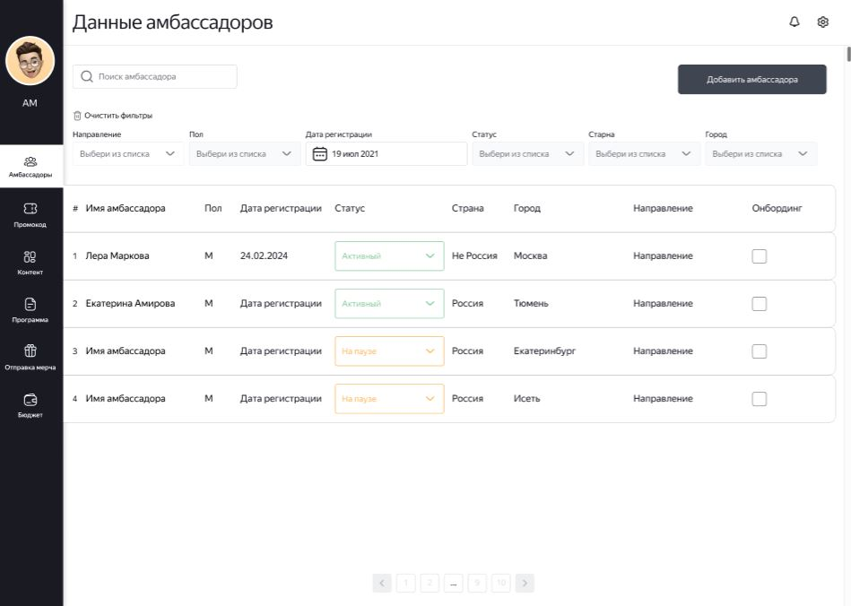

# Frontend для MVP приложения

## Описание проекта

СRM система должна помогать комьюнити- менеджерам и команде реферального маркетинга фиксировать затраченный бюджет по отправке мерча, управлять списками амбасадоров, формировать списки по отправке мерчадля коллег из логистики, хранить промокоды, создавать и отслеживать прогресс выполненных контент-заданий

## Используемые технологии

- TS [TypeScript](https://www.typescriptlang.org/)
- ⚛️[React](https://ru.reactjs.org/)
- ⚙️[Material-UI](https://material-ui.com/)

## Сведения о команде:

1. Панкрашина Ольга Сергеевна
2. Теременцев Дмитрий Сергеевич
3. Сидорчук Николай Иванович

## ссылка на Github Pages

https://k0t1k777.github.io/ambassadors_front

## Инструкции по установке и запуску

1. Клонируйте репозиторий: `git clone git@github.com:k0t1k777/ambassadors_front.git`
2. Перейдите в директорию проекта: `cd ambassadors_front`
3. Установите зависимости: `npm install`
4. Запустите проект: `npm run dev`

## Библиотеки,которые использовалис

1. mui/x-date-pickers-pro
2. mui/x-date-pickers
3. @mui/x-data-grid
4. @hookform/resolvers
5. yup
6. react-hook-form

## Ключевые точки для медиа min,max-width: 1440px

## Скриншоты

